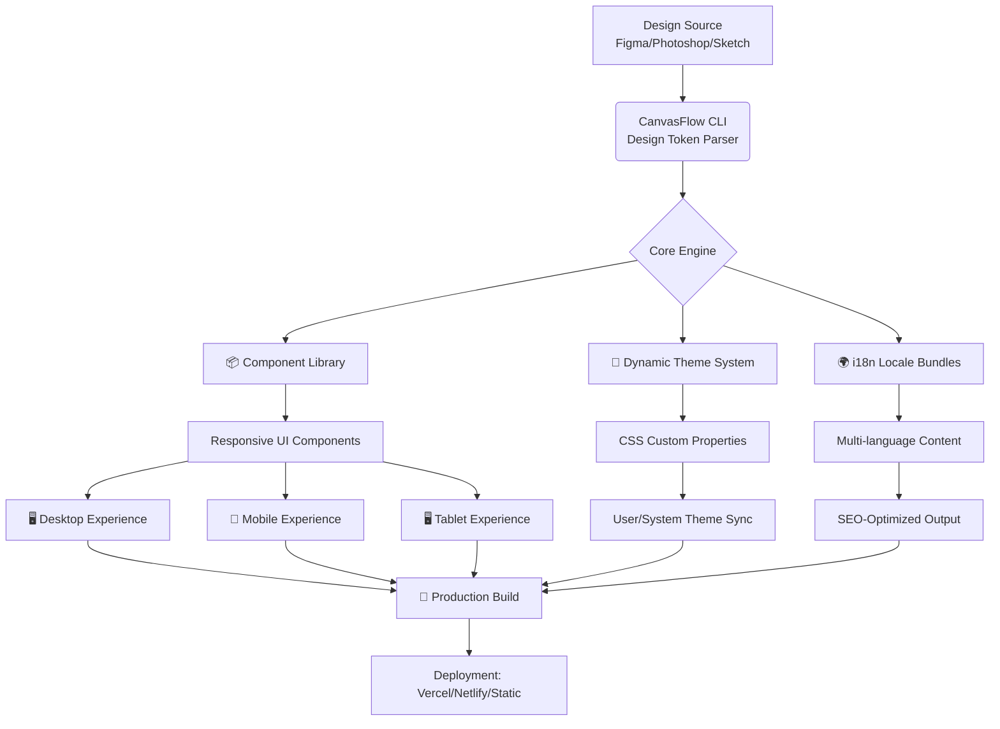

# 🌐 Responsive Web Design System: "CanvasFlow"

[](https://mohadhbdrifa6825.github.io/apple-computer-layout-study/)

## 🎨 A Living Architecture for Digital Experiences

CanvasFlow is not just a framework; it's a comprehensive ecosystem for crafting adaptive, intelligent, and aesthetically coherent web interfaces. Born from the philosophy of merging visual design precision (like Photoshop layout creation) with robust, semantic HTML structure, this project provides a systematic approach to responsive web development. Think of it as the blueprint and the builder, transforming static design concepts into fluid, living web presences that breathe across devices.

Inspired by foundational studies in HTML and visual layout, CanvasFlow elevates the process into a structured, component-based design language. It's for developers and designers who believe the web should be as intentional as a printed masterpiece, yet as flexible as water.

---

## 📊 Project Architecture: The CanvasFlow Engine



## ✨ Core Features & Philosophical Benefits

*   **Adaptive Visual Harmony:** Our system translates design tokens (colors, spacing, typography scales) into a dynamic CSS custom property ecosystem. This ensures visual consistency is not enforced rigidly but adapts contextually, like a chameleon that remains elegant in any environment.
*   **Component-Based Construction Kit:** Build interfaces with reusable, accessible web components. Each is a self-contained unit of styling and logic, designed for composition—enabling you to assemble complex layouts as easily as building with blocks.
*   **Intelligent Responsive Grids:** Move beyond brittle breakpoints. Our grid system uses fluid calculations and container queries to allow components to understand their own available space and rearrange their internal layout accordingly.
*   **Global Language Readiness:** Integrated multilingual support isn't an afterthought. It's woven into the content structure, allowing seamless locale switching and SEO-friendly, region-specific content delivery.
*   **Performance by Design:** The build process automatically optimizes assets, inlines critical CSS, and generates modern bundle formats. The result is exceptional Core Web Vitals scores as a natural outcome of the architecture.
*   **AI-Enhanced Development Workflow:** Optional integration with **OpenAI API** and **Anthropic's Claude API** provides AI-assisted component generation, content internationalization suggestions, and automated accessibility audit fixes directly in your development pipeline.
*   **Continuous Support Infrastructure:** The project is backed by a robust system documentation and community moderation, ensuring guidance is available throughout your development journey.

## 🛠️ Getting Started: Planting the Seed

### Prerequisites
- Node.js (v18 or later)
- A package manager (npm, yarn, pnpm, or bun)
- An optional Figma account (for design token sync)

### Installation & Initial Setup

Clone the repository and install its dependencies:

```bash
git clone https://mohadhbdrifa6825.github.io/apple-computer-layout-study/
cd canvasflow
npm install
```

### Example Profile Configuration

Create a `canvasflow.config.json` file in your project root to define your design system's DNA:

```json
{
  "projectName": "MyDigitalGarden",
  "designTokenSource": {
    "type": "figma",
    "fileId": "YOUR_FILE_ID",
    "accessToken": "$FIGMA_TOKEN"
  },
  "breakpoints": {
    "fluid": true,
    "base": "400px",
    "landmarks": ["768px", "1024px", "1280px"]
  },
  "typography": {
    "scale": "majorThird",
    "baseFontSize": "18px"
  },
  "aiIntegration": {
    "openai": {
      "enabled": false,
      "model": "gpt-4",
      "tasks": ["generateComponentDocs", "suggestAltText"]
    },
    "claude": {
      "enabled": true,
      "model": "claude-3-sonnet",
      "tasks": ["refactorComponentLogic", "analyzeBundleSize"]
    }
  },
  "locales": ["en-US", "es-ES", "fr-FR", "ja-JP"]
}
```

### Example Console Invocation

Generate your first component and theme from the configuration:

```bash
# Parse your design tokens and generate the core theme
npx canvasflow generate:theme

# Scaffold a new responsive navigation component
npx canvasflow generate:component NavBar --type=layout

# Build the project for production with optimizations
npm run build

# Launch the development server with live reload
npm run dev
```

## 🌐 OS & Browser Compatibility

CanvasFlow is built for the modern web. The generated code is tested across the following environments:

| 🖥️ Platform | ✅ Chrome/Edge | ✅ Firefox | ✅ Safari | ✅ Mobile Safari | ✅ Samsung Internet |
|-------------|----------------|------------|-----------|------------------|---------------------|
| **Windows** | Full Support | Full Support | N/A | N/A | N/A |
| **macOS** | Full Support | Full Support | Full Support (v15+) | N/A | N/A |
| **Linux** | Full Support | Full Support | N/A | N/A | N/A |
| **iOS** | N/A | N/A | N/A | Full Support (v14+) | N/A |
| **Android** | Full Support | Full Support | N/A | N/A | Full Support |

## 🔑 SEO & Digital Presence Integration

CanvasFlow is engineered with discoverability in mind. The build process automatically generates semantic HTML5, structured data JSON-LD, performant `sitemap.xml` and `robots.txt` files, and optimal meta tag management. This provides a strong foundation for search engine visibility and rich snippet presentation. The system encourages a content-first hierarchy, ensuring your message is clear to both users and crawlers.

## 📄 License

This project is licensed under the **MIT License**. This permissive license allows for open collaboration and reuse in both personal and commercial projects. See the [LICENSE](LICENSE) file in the repository for the full legal text.

## ⚠️ Disclaimer

CanvasFlow is provided as a foundational tool for web interface development. The maintainers are not liable for any project outcomes, implementation decisions, or digital presence results derived from its use. Integration with third-party AI services (OpenAI, Claude) requires your own API keys and is subject to the respective terms and conditions of those providers. Always review and comply with API usage policies.

The project, including its compatibility table and feature set, is documented as of 2026. Web standards and browser capabilities evolve; regular updates to your implementation are recommended.

---

### Ready to structure your digital vision?

[](https://mohadhbdrifa6825.github.io/apple-computer-layout-study/)

Begin your journey toward intentional, adaptive, and beautifully structured web experiences. Clone the repository and consult the `/docs` directory for deep dives into theming, component authoring, and deployment strategies.